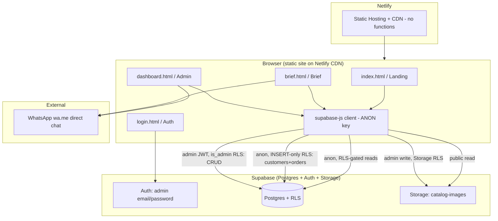
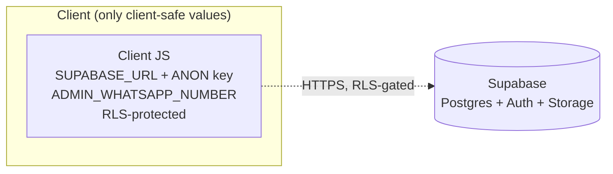
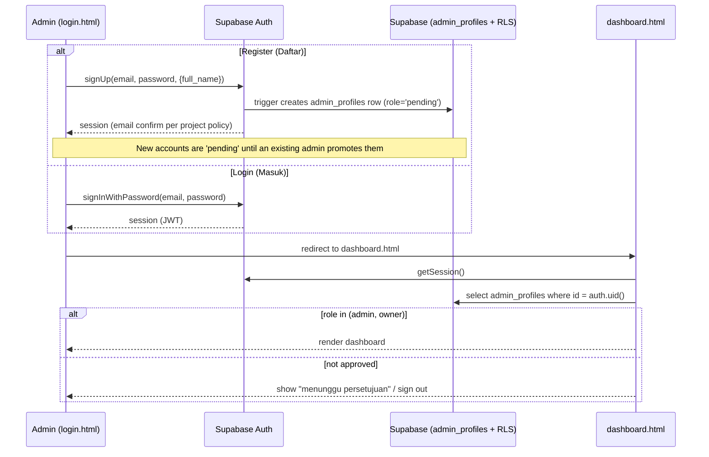
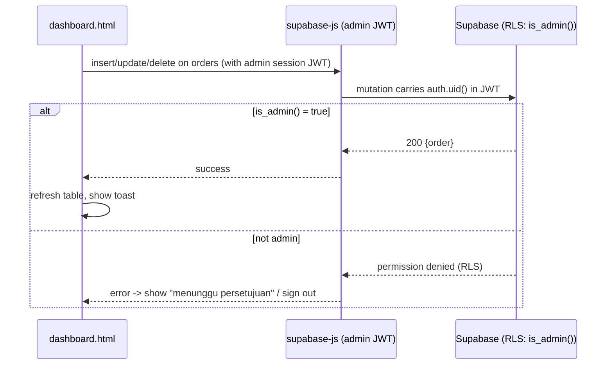

# Design Document: LogoKu — Netlify + Supabase Re-architecture

## Overview

LogoKu is an Indonesian logo-design service web app currently built on PHP + MySQL (XAMPP).
This re-architecture replaces the entire PHP stack with a **pure static frontend hosted on Netlify
talking directly to Supabase** — a **Supabase Postgres database**, **Supabase Auth** for admin login,
and **Supabase Storage** for catalog images. There are **no Netlify Functions and no server-side
code**: every operation the app needs (public reads, public brief inserts, admin auth, admin CRUD,
image upload) runs from the browser against Supabase, with **Row Level Security (RLS)** as the single
authorization boundary.

WhatsApp ordering is a **direct chat**: after a brief is saved, the browser opens a `wa.me` link to
the admin number (`6285236314038`) with a prefilled order summary. There is **no WhatsApp API, no
OTP, and no phone-verification provider** — per the product decision to keep ordering as a simple
direct chat.

The migration is driven by two hard constraints:

1. **Netlify does not run PHP.** Every `.php` page and every server-side PHP behavior must be
   re-expressed as static HTML/JS that talks to Supabase directly. Because we no longer need OTP or
   a hidden service-role key, **no serverless functions are required at all** — the app is a pure
   static site plus Supabase.
2. **Only client-safe values reach the browser.** The Supabase *anon* key (safe for the client,
   gated by RLS) and the public `SUPABASE_URL` are the only Supabase credentials shipped. The
   service-role key is **not used anywhere** in this architecture, so there is no secret to hide in
   a server tier.

The four redesigned mockups (`Landing`, `Login`, `Dashboard`, `Brief`) define the target UX. They
are authored in a proprietary `x-dc` templating format with `{{ }}` bindings and inline styles.
This design specifies converting them to **vanilla HTML/CSS/JS + the `@supabase/supabase-js`
client**, which is the lightest path consistent with static deployment on Netlify (no build step
required, though an optional Vite build is described for bundling).

> **Language note:** All code/pseudocode in this document uses **JavaScript/TypeScript**, since the
> target stack (Supabase JS client, static browser JS) is inherently JS/TS.

### Source-of-truth reconciliation (important finding)

While reading the legacy code I found the PHP and the SQL dump disagree on the schema:

| Source | Tables / columns it assumes |
|--------|------------------------------|
| `index.php`, `brief.php`, `core/order-handler.php`, `admin/login.php` | `categories`, `catalogs`, `users(whatsapp_number, full_name, role)`, `orders(client_id, package_id, reference_catalog_id, brand_name, tagline, brand_description, preferred_colors, logo_style_notes, status, order_number)` |
| `config/jasa_desain_baru.sql` (actual dump) | `admins(id_admin, username, password, nama_lengkap)`, `pesanan(nama_customer, no_wa, nama_brand, deskripsi_brief, status_progres ENUM, status_bayar ENUM, total_harga, jumlah_dp, bukti_bayar)` |

The **Dashboard mockup** uses the `pesanan` shape (progres: Antrean → Selesai; bayar: Belum Lunas/DP/Lunas; total; dp). The **Brief mockup** collects the richer `orders` fields (tagline, colors, style notes). The new Postgres schema below **unifies both** into a single `orders` table that carries the creative-brief fields *and* the admin workflow fields (progress status, payment status, total, dp, payment proof).

---

## Goals and Non-Goals

**Goals**
- Fully static, PHP-free deployment on Netlify with a custom domain over HTTPS — **no serverless functions**.
- Public catalog/pricing browsing with no login, reading from Supabase via the anon key under RLS.
- Brief submission that stores a structured order in Supabase **directly from the browser** (anon key under a restrictive INSERT-only RLS policy), then hands off to WhatsApp via a `wa.me` direct chat.
- Admin authentication via Supabase Auth (email/password) with a register ("Daftar") flow and a role gate.
- Admin dashboard backed by Supabase for orders, customers, catalog management, and settings — all CRUD performed directly via `supabase-js` under RLS (`is_admin()`).
- Catalog image hosting in Supabase Storage with admin upload (Storage RLS), replacing `uploads/catalog/`.
- Clear authorization boundary: **RLS is the only gate**; the client carries only the anon key + URL.

**Non-Goals**
- Building a full customer-facing account/login system (the existing "zero-login via WhatsApp" model is preserved for clients).
- **Any WhatsApp API, OTP, or phone-verification provider** — ordering is a plain `wa.me` direct chat.
- Online payment processing (payment remains manual/offline, tracked by `payment_status`).
- Migrating the legacy production MySQL data automatically (a one-time export/transform script is described but data volume is tiny — 3 rows — so manual reentry is acceptable).
- Running any server-side tier (no Netlify Functions, no service-role key in use).

---

## Legacy → Target Mapping (What to Replace / Keep / Add)

| Legacy artifact | Behavior | Target disposition | New equivalent |
|-----------------|----------|--------------------|----------------|
| `index.php` | Landing page; reads `categories`+`catalogs`, static fallback, pricing/workflow/FAQ | **Replace** | `index.html` (from `Landing.dc.html`) + `catalog.js` fetching catalog via Supabase anon client |
| `brief.php` | Creative brief form; package/ref query params; WhatsApp handoff | **Replace** | `brief.html` (from `Brief.dc.html`) + `brief.js`; client-side validation + **direct anon insert** of customer & order into Supabase, then `wa.me` handoff |
| `core/order-handler.php` | Validates input, upserts `users`, inserts `orders`, builds WA message, redirects | **Replace** | **Client-side** `submitBrief()` in `brief.js`: validate → insert customer → insert order (anon key, INSERT-only RLS) → build order number → `wa.me` direct chat (no function) |
| `admin/login.php` | Session-based admin login against `users`/`admins` | **Replace** | `login.html` (from `Login.dc.html`) + Supabase Auth (email/password); role gate |
| `admin/dashboard.php` (referenced, not present) | Admin order management | **Add** (new) | `dashboard.html` (from `Dashboard.dc.html`) + `dashboard.js` using Supabase directly (reads + CRUD under `is_admin()` RLS) |
| `config/database.php` | PDO MySQL connection + session bootstrap | **Replace** | `lib/supabaseClient.js` (browser, anon key only — no server client) |
| `config/jasa_desain_baru.sql` | MySQL schema | **Replace** | Supabase migration `supabase/migrations/0001_init.sql` (Postgres + RLS) |
| `includes/header.php`, `includes/footer.php` | Shared layout (server includes) | **Replace** | Shared markup baked into each page or injected by a small `layout.js`; no server includes on static hosting |
| `assets/css/style.css` | Light-theme styling | **Keep as reference / supersede** | New dark "3D glass" theme from mockups in `assets/css/app.css` |
| `assets/js/main.js` | Mobile menu, catalog filter, FAQ accordion, color pickers | **Keep behavior, port** | Re-implemented in `catalog.js` / `brief.js`; logic carries over directly |
| `uploads/catalog/` local folder | Catalog images on disk | **Replace** | Supabase Storage bucket `catalog-images` (public read, admin write) |
| PHP `$_SESSION['admin_logged_in']` | Auth state | **Replace** | Supabase Auth session (JWT in browser storage via supabase-js) |
| WhatsApp `wa.me` handoff to `6285236314038` | Order notification | **Keep** | Same **direct-chat** handoff, message built client-side after order persists (no API) |

---

## Architecture



**Key boundaries**
- **Public reads** (catalog, categories, pricing) go directly browser → Supabase using the anon key. RLS allows `SELECT` only on published rows.
- **Public brief writes** go directly browser → Supabase using the anon key under a **restrictive INSERT-only** RLS policy: anon may `INSERT` into `customers` and `orders` but can **never `SELECT`** them back. Client-side validation runs first.
- **Admin reads and all mutations** (orders, customers, catalogs) go browser → Supabase using the *logged-in admin's* JWT; RLS permits these only when `is_admin()` is true.
- There is **no server tier**: no Netlify Functions, no service-role key. Authorization is enforced entirely by Postgres RLS.



> There is no separate "functions secret zone" — the service-role key is not used anywhere in this
> architecture, so no privileged secret exists outside Supabase itself.

---

## Sequence Diagrams

### Brief submission (direct client insert + WhatsApp handoff)

```mermaid
sequenceDiagram
    participant U as User (brief.html)
    participant SDK as supabase-js (anon key)
    participant DB as Supabase (RLS: anon INSERT-only)
    participant WA as WhatsApp (wa.me)

    U->>U: Step 1 — Kontak: WhatsApp number + name (no OTP)
    U->>U: Step 2 — Brief: brand, colors, notes
    U->>U: Client-side validation (required fields, phone, hex, dp<=total)
    U->>SDK: upsert customer {whatsapp_number, full_name}
    SDK->>DB: INSERT customers (anon INSERT policy)
    DB-->>SDK: customer id
    U->>SDK: insert order {customer_id, brief..., status='Antrean', payment='Belum Lunas'}
    SDK->>DB: INSERT orders (anon INSERT policy; no SELECT-back)
    DB-->>SDK: ok (returning minimal/own row id where permitted)
    U->>U: build order number LKU-YYYY-#### (client) for the message
    U->>WA: open wa.me/6285236314038 with prefilled order summary
    Note over U,DB: anon cannot SELECT orders/customers — read isolation preserved
```

### Admin authentication (login + register + role gate)



### Admin manual order create / edit (direct, RLS-gated)



---

## Components and Interfaces

### Frontend pages (static)

| Page | File | Source mockup | Responsibilities |
|------|------|---------------|------------------|
| Landing | `index.html` + `js/catalog.js` | `Landing.dc.html` | Hero/stats, benefits, **dynamic catalog with category filter**, workflow, pricing, testimonials, FAQ accordion, floating WhatsApp button |
| Brief | `brief.html` + `js/brief.js` | `Brief.dc.html` | Package display from `?paket=`, **Step 1 contact (WhatsApp number + name, no OTP)**, **Step 2 brief spec**, color pickers, validate → direct anon insert (customer + order) → `wa.me` direct-chat handoff |
| Auth | `login.html` + `js/auth.js` | `Login.dc.html` | Masuk/Daftar tabs, Supabase Auth, "Ingat saya", "Lupa sandi?", redirect to dashboard |
| Dashboard | `dashboard.html` + `js/dashboard.js` | `Dashboard.dc.html` | Sidebar nav, stat cards, status distribution, recent orders, full orders table (edit/chat/delete), customers, settings, manual-order modal, toast |

**Shared frontend modules**

```typescript
// lib/supabaseClient.ts — browser, anon key only (the ONLY Supabase client in the app)
import { createClient } from '@supabase/supabase-js'
export const supabase = createClient(
  window.__ENV__.SUPABASE_URL,      // injected at build or via env.js
  window.__ENV__.SUPABASE_ANON_KEY  // safe for client; RLS enforces access
)

// lib/orders.ts — public brief submission (direct anon insert under INSERT-only RLS)
export interface CreateOrderInput { /* phone, fullName, brand fields, colors, ids */ }
export function submitBrief(input: CreateOrderInput): Promise<{ orderNumber: string }>

// lib/admin.ts — admin CRUD helpers (direct supabase-js under is_admin() RLS)
export function listOrders(): Promise<OrderRow[]>
export function saveOrder(draft: OrderDraft): Promise<OrderRow>   // insert/update
export function deleteOrder(id: number): Promise<void>

// lib/wa.ts — WhatsApp handoff URL builder (pure)
export function buildWaHandoff(adminPhone: string, order: OrderSummary): string
```

> There is **no `lib/api.ts`** and **no Netlify Function wrappers** — the browser talks to Supabase
> directly for every operation. Authorization is RLS.

### Server-side tier

**None.** This architecture has no Netlify Functions and no service-role client
(`_shared/supabaseAdmin.ts` is eliminated). Every responsibility that previously lived in a function
is now either:

- **Public brief insert** → `lib/orders.ts#submitBrief` using the anon key under an INSERT-only RLS policy (client-side validation first).
- **Admin CRUD** → `lib/admin.ts` using `supabase-js` with the logged-in admin's JWT under `is_admin()` RLS.
- **Catalog image upload** → `supabase.storage` directly, gated by Storage RLS (`is_admin()`).

The only place credentials are read is `lib/supabaseClient.ts`, and it reads **only** the public URL
and anon key.

---

## Data Models

### Postgres schema (migrated from MySQL, unified)

```sql
-- categories: catalog taxonomy (from legacy `categories`)
create table categories (
  id          bigint generated always as identity primary key,
  category_name text not null,
  slug        text not null unique,
  created_at  timestamptz not null default now()
);

-- catalogs: portfolio items (from legacy `catalogs`)
create table catalogs (
  id            bigint generated always as identity primary key,
  category_id   bigint references categories(id) on delete set null,
  title         text not null,
  description   text,
  image_path    text,            -- Supabase Storage object path (replaces uploads/catalog/<file>)
  is_published  boolean not null default true,
  sort_order    int not null default 0,
  created_at    timestamptz not null default now()
);

-- customers: brief submitters (from legacy `users` role='client' + `pesanan.nama_customer/no_wa`)
create table customers (
  id              bigint generated always as identity primary key,
  whatsapp_number text not null unique,   -- normalized 62xxxxxxxxxx
  full_name       text not null,
  created_at      timestamptz not null default now()
);

-- progress + payment enums (from legacy `pesanan` ENUMs; preserved verbatim, Indonesian)
create type progress_status as enum ('Antrean','Proses Sketsa','Digitalisasi','Revisi','Selesai');
create type payment_status  as enum ('Belum Lunas','DP','Lunas');

-- orders: unified creative brief (legacy `orders`) + admin workflow (legacy `pesanan`)
create table orders (
  id                   bigint generated always as identity primary key,
  order_number         text unique,                 -- LKU-YYYY-XXXXXX built client-side at submit (see note)
  customer_id          bigint not null references customers(id) on delete cascade,
  package_id           int,                          -- 1..4 pricing package (nullable)
  reference_catalog_id bigint references catalogs(id) on delete set null,
  -- creative brief fields (from Brief form)
  brand_name           text not null,
  tagline              text,
  brand_description    text not null,
  primary_color        text,                         -- hex e.g. #7c3aed
  secondary_color      text,
  logo_style_notes     text,
  -- admin workflow fields (from Dashboard)
  progress_status      progress_status not null default 'Antrean',
  payment_status       payment_status  not null default 'Belum Lunas',
  total_amount         int not null default 0,       -- IDR, integer rupiah
  dp_amount            int not null default 0,
  payment_proof_path   text,                          -- Supabase Storage object path
  created_at           timestamptz not null default now(),
  updated_at           timestamptz not null default now()
);

-- admin_profiles: links Supabase Auth users to roles (replaces legacy `admins`)
create table admin_profiles (
  id         uuid primary key references auth.users(id) on delete cascade,
  full_name  text,
  role       text not null default 'pending',  -- 'pending' | 'admin' | 'owner'
  created_at timestamptz not null default now()
);
```

> **No `otp_verifications` table.** Ordering uses a `wa.me` direct chat with no OTP, so there is no
> verification state to persist.

**Validation rules**
- `whatsapp_number`: digits only, normalized to `62`-prefixed E.164-style; leading `0` → `62`, bare number → prefixed `62`.
- `primary_color` / `secondary_color`: 7-char hex (`#RRGGBB`); default brand color if absent.
- `package_id`: integer 1–4 mapping to {80k, 140k, 199k, 250k}; nullable when ordered from a catalog reference only.
- `total_amount`, `dp_amount`: non-negative integers (rupiah, no decimals); `dp_amount <= total_amount`.
- `progress_status`, `payment_status`: constrained by enum types (exact legacy Indonesian labels).
- `order_number`: format `LKU-<year>-<6+ alphanumeric>`, unique. Built **client-side** at submit
  time (e.g. `LKU-` + year + base36 of a timestamp + small random suffix) because anon inserts
  cannot read back a DB-generated id; the DB `unique` constraint guarantees no collisions.

### Row Level Security (RLS) policies

```sql
alter table categories         enable row level security;
alter table catalogs           enable row level security;
alter table customers          enable row level security;
alter table orders             enable row level security;
alter table admin_profiles     enable row level security;

-- helper: is the current JWT an approved admin?
create or replace function is_admin() returns boolean
language sql security definer stable as $$
  select exists (
    select 1 from admin_profiles
    where id = auth.uid() and role in ('admin','owner')
  );
$$;

-- PUBLIC READS (anon): published catalog + categories only
create policy "public read categories" on categories
  for select to anon, authenticated using (true);
create policy "public read published catalogs" on catalogs
  for select to anon, authenticated using (is_published = true);

-- ADMIN MANAGES CATALOG
create policy "admin all catalogs" on catalogs
  for all to authenticated using (is_admin()) with check (is_admin());
create policy "admin all categories" on categories
  for all to authenticated using (is_admin()) with check (is_admin());

-- PUBLIC BRIEF WRITES (anon): INSERT-ONLY, never SELECT back
-- The public brief form persists directly from the browser using the anon key.
-- anon may INSERT customers/orders but has NO select/update/delete policy, so it
-- can never read others' (or its own) rows back -> read isolation preserved.
create policy "anon insert customers" on customers
  for insert to anon with check (true);
create policy "anon insert orders" on orders
  for insert to anon with check (
    -- only allow brand-new public orders in their initial state
    progress_status = 'Antrean' and payment_status = 'Belum Lunas'
  );

-- ORDERS + CUSTOMERS: readable + fully mutable by admins only
create policy "admin read orders" on orders
  for select to authenticated using (is_admin());
create policy "admin write orders" on orders
  for all to authenticated using (is_admin()) with check (is_admin());
create policy "admin read customers" on customers
  for select to authenticated using (is_admin());
create policy "admin write customers" on customers
  for all to authenticated using (is_admin()) with check (is_admin());

-- ADMIN PROFILES: a user can read own profile; only owners can change roles
create policy "read own profile" on admin_profiles
  for select to authenticated using (id = auth.uid() or is_admin());
create policy "owner manages roles" on admin_profiles
  for update to authenticated using (
    exists (select 1 from admin_profiles where id = auth.uid() and role = 'owner')
  );
```

> **Note on order inserts:** Public brief submissions insert into `customers` and `orders`
> **directly from the browser** using the anon key, permitted only by the INSERT-only policies
> above. Because anon has **no SELECT/UPDATE/DELETE** policy on those tables, a public visitor can
> create an order but can never read, list, or modify any order or customer — including their own.
> This keeps the read-isolation guarantee while removing the need for any server tier.
>
> **Spam tradeoff & lightweight mitigation:** allowing anon inserts means a determined actor could
> POST junk orders. Per the "no API" preference we keep mitigation lightweight: (1) client-side
> validation of required fields, phone format, and hex colors; (2) an optional hidden **honeypot**
> field that, if filled, aborts submission; (3) optional Supabase-side **rate limiting** (e.g. a
> per-phone/per-IP throttle via a `before insert` trigger or Supabase's network restrictions). No
> OTP or external provider is used. Admins triage/delete spam from the dashboard.

### Storage buckets

| Bucket | Visibility | Read | Write |
|--------|-----------|------|-------|
| `catalog-images` | public | anyone (public URL) | admins only (Storage RLS: `is_admin()`) |
| `payment-proofs` | private | admins only (signed URLs) | admins only via `supabase.storage` under Storage RLS (`is_admin()`) |

`catalogs.image_path` and `orders.payment_proof_path` store the object path; the client builds a
public URL for catalog images and the dashboard requests signed URLs for payment proofs.

---

## Project Structure (Netlify static deploy)

```
/                         # repo root = Netlify "publish" base (or /public if Vite build is used)
├── index.html            # Landing (from Landing.dc.html)
├── brief.html            # Brief (from Brief.dc.html)
├── login.html            # Auth (from Login.dc.html)
├── dashboard.html        # Admin (from Dashboard.dc.html)
├── assets/
│   ├── css/app.css       # dark 3D-glass theme extracted from mockups
│   └── js/
│       ├── lib/supabaseClient.js
│       ├── lib/orders.js     # public brief submit (anon insert)
│       ├── lib/admin.js      # admin CRUD via supabase-js under RLS
│       ├── lib/wa.js
│       ├── catalog.js
│       ├── brief.js
│       ├── auth.js
│       └── dashboard.js
├── supabase/
│   └── migrations/0001_init.sql   # schema + RLS + storage policies
├── netlify.toml
├── package.json
├── .env.example                   # documents required env vars (no secrets committed)
└── _legacy/                       # archived PHP app (index.php, brief.php, admin/, core/, config/, includes/)
```

> There is **no `netlify/functions/` directory** — the app is a pure static site. The only build-time
> concern is injecting the public env values (`env.js`); see Environment variables.

**Disposition of old PHP files:** move all `.php`, `config/*.sql`, `includes/*`, `core/*`, and
`admin/*` into `_legacy/` (archived, excluded from Netlify publish). They are not deleted so the
business logic remains a reference during migration; once verified in production they can be
removed in a follow-up cleanup. The legacy `assets/` light theme is superseded by `assets/css/app.css`.

### `netlify.toml`

```toml
[build]
  publish = "."                 # or "dist" if using the optional Vite build

# No [functions] section and no /api redirect — there are no serverless functions.

# SPA-style friendly 404 (optional)
[[redirects]]
  from = "/*"
  to = "/index.html"
  status = 404
```

### Environment variables

| Variable | Scope | Notes |
|----------|-------|-------|
| `SUPABASE_URL` | client | Public project URL |
| `SUPABASE_ANON_KEY` | client | Safe in browser; RLS-gated |
| `ADMIN_WHATSAPP_NUMBER` | client | `6285236314038` for the `wa.me` direct-chat handoff (non-secret) |

> **No `SUPABASE_SERVICE_ROLE_KEY`**, **no `OTP_PROVIDER_API_KEY`**, **no `OTP_HMAC_SECRET`** — the
> architecture has no server tier and no OTP, so no privileged or provider secrets exist. (If a
> future server-side need ever arises, a service-role key would be reintroduced *only* inside that
> server context — not in the client. None is needed today.)

Client env injection without a build step: ship a tiny `env.js` generated at deploy time (Netlify
build command writes `window.__ENV__ = { SUPABASE_URL, SUPABASE_ANON_KEY, ADMIN_WHATSAPP_NUMBER }`),
or use the optional Vite build with `import.meta.env`. All three values are client-safe; there are
no function-only secrets to manage.

---

## Low-Level Design: Key Functions with Formal Specifications

### `normalizePhone(raw) -> string`

```typescript
function normalizePhone(raw: string): string
```

**Preconditions**
- `raw` is a string that may contain spaces, dashes, `+`, or a leading `0` / `62` / `8`.

**Postconditions**
- Returns digits-only string beginning with `62`.
- `'0812...'` → `'62812...'`; `'+62812...'` / `'62812...'` → `'62812...'`; `'812...'` → `'62812...'`.
- Idempotent: `normalizePhone(normalizePhone(x)) === normalizePhone(x)`.
- Throws/returns error sentinel if no digits remain.

### `generateOrderNumber(now, rand) -> string`

```typescript
function generateOrderNumber(now: Date, rand: () => number): string
```

**Preconditions**
- `now` is a valid date; `rand` returns a value in `[0, 1)`.

**Postconditions**
- Returns a string matching `^LKU-\d{4}-[0-9A-Z]{6,}$` (year + base36 timestamp + random suffix).
- Built entirely client-side (no DB round-trip); collisions are rejected by the `orders.order_number` unique constraint, in which case `submitBrief` retries with a fresh suffix.
- Pure given `now`/`rand`.

### `submitBrief(supabase, input) -> { orderNumber }`

```typescript
function submitBrief(supabase: AnonClient, input: CreateOrderInput): Promise<{ orderNumber: string }>
```

**Preconditions**
- Client-side validation has passed: `input.whatsappNumber` normalizes to `62xxx`; `input.fullName`, `input.brandName`, `input.brandDescription` are non-empty; `input.packageId ∈ {1,2,3,4} ∪ {null}`; colors are hex or null; the honeypot field is empty.
- `supabase` is the **anon** client (the only client in the app); RLS exposes INSERT-only on `customers`/`orders`.

**Postconditions**
- A `customers` row exists for the normalized `whatsappNumber` (insert; on conflict the existing row is reused — see note).
- Exactly one new `orders` row is inserted with `progress_status='Antrean'`, `payment_status='Belum Lunas'` (the only state the anon INSERT policy permits) and `order_number` built by `generateOrderNumber`.
- Returns the client-built `orderNumber` for the WhatsApp summary; the function never reads orders/customers back (anon has no SELECT).
- On insert failure (validation/constraint/RLS) it surfaces a structured error and persists no order; the caller does not open WhatsApp.

> **Upsert-by-phone note:** because anon cannot SELECT, "upsert" is implemented as an `insert ...
> on conflict (whatsapp_number) do nothing/update` so the customer row is created or matched without
> a read. If `customer_id` is needed for the order insert and cannot be read back, the design links
> the order to the customer via the unique `whatsapp_number` (denormalized on the order) or uses a
> single `insert` with a nested relation; the migration chooses the concrete form.

**Loop invariants:** N/A (a bounded retry on order-number collision only).

---

## Algorithmic Pseudocode

### `submitBrief` client algorithm (public order persistence, no server)

```pascal
ALGORITHM submitBrief(form)
INPUT: form fields from brief.html (contact + brief + hidden honeypot)
OUTPUT: opens wa.me direct chat | shows validation/error message

BEGIN
    // 0. Anti-spam: hidden honeypot must be empty
    IF form.company_website <> '' THEN RETURN silently END IF   // bot trap

    // 1. Client-side validation (no OTP)
    phone <- normalizePhone(form.phone)
    ASSERT phone matches '62[0-9]{7,}'
    ASSERT nonEmpty(form.fullName) AND nonEmpty(form.brandName) AND nonEmpty(form.brandDescription)
    ASSERT form.packageId IN {1,2,3,4} OR form.packageId = NULL
    ASSERT isHexOrNull(form.primaryColor) AND isHexOrNull(form.secondaryColor)

    // 2. Insert customer (anon key, INSERT-only RLS; on conflict reuse by phone)
    supabase.from('customers')
            .upsert({ whatsapp_number: phone, full_name: form.fullName },
                    { onConflict: 'whatsapp_number' })

    // 3. Build order number client-side (anon cannot read DB-generated id)
    orderNumber <- generateOrderNumber(now(), random)

    // 4. Insert order (anon INSERT policy enforces the initial state)
    REPEAT (bounded retries on order_number unique collision)
        result <- supabase.from('orders').insert({
                     order_number: orderNumber,
                     // customer linked by phone/relation per migration form
                     package_id: form.packageId,
                     reference_catalog_id: form.refId,
                     brand_name: form.brandName,
                     tagline: form.tagline,
                     brand_description: form.brandDescription,
                     primary_color: form.primaryColor,
                     secondary_color: form.secondaryColor,
                     logo_style_notes: form.notes,
                     progress_status: 'Antrean',
                     payment_status: 'Belum Lunas'
                  })
        IF result.error = 'unique_violation(order_number)' THEN
            orderNumber <- generateOrderNumber(now(), random)
        END IF
    UNTIL result.ok OR retries exhausted

    IF NOT result.ok THEN
        showMessage('Gagal menyimpan pesanan, coba lagi.'); RETURN
    END IF

    // 5. WhatsApp direct-chat handoff (no API)
    url <- buildWaHandoff(ENV.ADMIN_WHATSAPP_NUMBER, {
              orderNumber, fullName: form.fullName, phone,
              brandName: form.brandName,
              primaryColor: form.primaryColor, secondaryColor: form.secondaryColor })
    window.location.href = url   // opens wa.me/6285236314038 with prefilled summary
END
```

**Preconditions:** valid normalized phone and non-empty required fields; `supabase` is the anon client.
**Postconditions:** exactly one order persisted on success; WhatsApp opened only after persistence; anon never reads orders/customers back.
**Loop invariants:** before each retry, no order with the current `orderNumber` has been committed (the unique constraint guarantees this).

### Catalog filter (ported from legacy `main.js`, now data-driven)

```pascal
ALGORITHM renderCatalog(allItems, activeFilter)
INPUT: allItems (from Supabase), activeFilter (slug or 'all')
OUTPUT: visibleItems rendered to #catalogGrid

BEGIN
    visibleItems <- []
    FOR each item IN allItems DO
        // INVARIANT: visibleItems contains exactly the processed items whose
        // category matches activeFilter (or all, when activeFilter='all')
        IF activeFilter = 'all' OR item.category_slug = activeFilter THEN
            visibleItems.append(item)
        END IF
    END FOR
    clear(#catalogGrid)
    FOR each item IN visibleItems DO
        appendCard(#catalogGrid, item)   // card links to brief.html?ref=item.id
    END FOR
END
```

### Admin role gate on dashboard load

```pascal
ALGORITHM guardDashboard()
BEGIN
    session <- supabase.auth.getSession()
    IF session = NULL THEN
        redirect('login.html'); RETURN
    END IF
    profile <- supabase.from('admin_profiles').select('role').eq('id', session.user.id).single()
    IF profile = NULL OR profile.role NOT IN ('admin','owner') THEN
        showMessage('Akun menunggu persetujuan admin.')
        supabase.auth.signOut()
        redirect('login.html'); RETURN
    END IF
    loadDashboardData()   // orders, customers, stats via RLS-gated reads
END
```

---

## Example Usage

```typescript
// brief.js — validate, insert directly (anon), then hand off to WhatsApp (no OTP, no API)
import { submitBrief } from './lib/orders.js'
import { buildWaHandoff } from './lib/wa.js'

async function onSubmitBrief(form) {
  // honeypot + field validation happen inside submitBrief
  const input = {
    phone: form.phone, fullName: form.fullName,
    packageId: form.paket ? Number(form.paket) : null,
    refId: form.ref ? Number(form.ref) : null,
    brandName: form.brandName, tagline: form.tagline,
    brandDescription: form.description,
    primaryColor: form.primaryColor, secondaryColor: form.secondaryColor,
    notes: form.styleNotes,
    company_website: form.company_website, // hidden honeypot, expected empty
  }
  const { orderNumber } = await submitBrief(input)   // anon insert under INSERT-only RLS
  // WhatsApp direct chat to the listed admin number
  window.location.href = buildWaHandoff(window.__ENV__.ADMIN_WHATSAPP_NUMBER, {
    orderNumber, fullName: input.fullName, phone: input.phone,
    brandName: input.brandName, primaryColor: input.primaryColor, secondaryColor: input.secondaryColor,
  })
}
```

```typescript
// auth.js — Supabase Auth login + register
import { supabase } from './lib/supabaseClient.js'

export async function login(email, password) {
  const { error } = await supabase.auth.signInWithPassword({ email, password })
  if (error) throw error
  location.href = 'dashboard.html'
}

export async function register(email, password, fullName) {
  const { error } = await supabase.auth.signUp({
    email, password, options: { data: { full_name: fullName } },
  })
  if (error) throw error
  // a DB trigger inserts admin_profiles row with role='pending'
  showInfo('Akun dibuat. Menunggu persetujuan admin sebelum bisa mengakses dashboard.')
}
```

```typescript
// dashboard.js — admin reads AND mutates orders directly (RLS-gated by is_admin())
const { data: orders } = await supabase
  .from('orders').select('*, customers(full_name, whatsapp_number)')
  .order('created_at', { ascending: false })

async function saveManualOrder(draft) {
  // direct insert/update under is_admin() RLS; the admin's JWT authorizes the write
  const { data, error } = await supabase.from('orders').upsert(draft).select().single()
  if (error) throw error
  return data
}
```

```sql
-- Trigger that provisions an admin_profiles row on signup
create or replace function handle_new_user() returns trigger
language plpgsql security definer as $$
begin
  insert into admin_profiles (id, full_name, role)
  values (new.id, new.raw_user_meta_data->>'full_name', 'pending');
  return new;
end; $$;
create trigger on_auth_user_created
  after insert on auth.users for each row execute function handle_new_user();
```

---

## Error Handling

| Scenario | Condition | Response | Recovery |
|----------|-----------|----------|----------|
| Invalid brief input | Client validation fails (missing field, bad phone/hex) | Inline form error; submission blocked before any insert | User corrects fields and resubmits |
| Honeypot tripped | Hidden field non-empty (likely bot) | Submission silently aborted; no insert | N/A (legitimate users never fill it) |
| Order number collision | `orders.order_number` unique violation | `submitBrief` regenerates number and retries (bounded) | Transparent to user; fails with generic error if retries exhausted |
| Order insert rejected by RLS | anon tries non-initial state / wrong table op | `permission denied`; UI shows generic "gagal menyimpan" | User retries; admins unaffected |
| Order insert fails | DB/constraint/network error | No order persisted; UI shows retry message; WhatsApp NOT opened | User resubmits |
| Public spam inserts | Many junk orders from anon | Lightweight: client validation + honeypot + optional rate limit | Admin triages/deletes from dashboard |
| Admin read/write when not signed in | No Supabase session | RLS denies; UI redirects to `login.html` | Re-login |
| Authenticated non-admin | `role='pending'` | RLS denies (`is_admin()` false); show "menunggu persetujuan" | Owner promotes role |
| Catalog read when DB empty | No rows | Render static fallback cards (mirrors legacy behavior) | Admin adds catalog items |
| Storage upload rejected | Non-admin / bad mime | Storage RLS denies | Admin re-auth / correct file type |
| anon attempts to read orders | anon `select` on orders/customers | RLS returns no rows / denied | By design — public can never read operational data |

**Cross-cutting:** Supabase returns structured error objects; the UI maps them to friendly Indonesian
messages and never surfaces raw DB text (legacy `order-handler.php` leaked `PDOException` text to
users — this is fixed). Because there is no server tier, there are no stack traces to leak.

---

## Testing Strategy

### Unit testing
- `normalizePhone`, `generateOrderNumber`, `buildWaHandoff` — pure functions, fully unit-tested with a runner such as **Vitest**.
- `submitBrief` validation guards (required fields, hex colors, honeypot, `dp_amount <= total_amount` in the manual-order save) tested with mocked Supabase client.
- Catalog filter and dashboard reducers (status/payment style maps, rupiah formatting) ported from mockups.

### Property-based testing
**Library:** `fast-check` (JS/TS).

- `normalizePhone` idempotence: ∀ raw, `normalize(normalize(raw)) == normalize(raw)`.
- `normalizePhone` prefix: ∀ valid raw, output starts with `62` and is digits-only.
- `generateOrderNumber` format: ∀ now/rand, output matches `^LKU-\d{4}-[0-9A-Z]{6,}$`.
- `buildWaHandoff` correctness: ∀ order summaries, output is a valid `https://wa.me/<adminPhone>?text=...` URL with the order number present and properly URL-encoded.
- `dp_amount <= total_amount` preserved by manual-order save logic.

### Integration testing
- Against a local Supabase instance (`supabase start`): RLS **denies** anon `select` on `orders`/`customers`, **allows** anon `insert` on `orders`/`customers` only in the initial state, **allows** anon `select` on published `catalogs`, and **allows** admin CRUD under `is_admin()`. Verify `submitBrief` end-to-end creates exactly one order and that anon cannot read it back. Storage policies enforce admin-only catalog writes.
- No Netlify Functions to test (none exist); the static site is exercised directly against Supabase.

---

## Correctness Properties

### Property 1: Public order submission integrity
∀ orders created via the public path, the row is inserted through the **anon INSERT policy** with all required fields validated client-side and the initial state (`progress_status='Antrean'`, `payment_status='Belum Lunas'`) enforced by the policy `with check`. Anon may `INSERT` `orders`/`customers` but can **never `SELECT`** them back, so the public path can create — but never read or enumerate — operational data.
**Validates: Requirements 3.6, 3.9, 7.2, 7.3**

### Property 2: Secret isolation
The client bundle contains only `SUPABASE_URL`, `SUPABASE_ANON_KEY`, and `ADMIN_WHATSAPP_NUMBER`; ∀ published assets, no privileged or provider secret (service-role key, OTP/provider key) appears anywhere, because there is **no server tier** in which such a secret could exist.
**Validates: Requirements 7.4, 7.5**

### Property 3: Admin gate on mutations
∀ mutations to `orders`, `customers`, or `catalogs`, the actor is an approved admin (`role ∈ {admin, owner}`) — enforced by Postgres RLS (`is_admin()`), the single authorization boundary.
**Validates: Requirements 4.4, 5.4, 5.5, 7.3**

### Property 4: Read isolation
Anon clients can `select` only published `catalogs` and `categories`; never `orders`, `customers`, or other users' `admin_profiles`.
**Validates: Requirements 1.2, 7.2**

### Property 5: Atomic order + customer insert
A public submission's `customers` row (created/matched by phone) and its `orders` row are persisted together or not at all; on any insert failure no partial order remains and the WhatsApp handoff is not opened.
**Validates: Requirements 3.6**

### Property 6: Idempotent phone normalization
∀ raw input, `normalizePhone(normalizePhone(raw)) === normalizePhone(raw)`, and every output is digits-only with a `62` prefix.
**Validates: Requirements 3.2**

---

## Performance Considerations
- Static assets served from Netlify CDN; pages are lightweight HTML + a few KB of JS.
- Catalog read is a single indexed query (`catalogs` filtered by `is_published`, joined to `categories`); add index on `catalogs(category_id)` and `catalogs(is_published, sort_order)`.

## Security Considerations
- **RLS-first**: every table has RLS enabled; default-deny with explicit policies (see Data Models). With no server tier, RLS is the single authorization boundary.
- **Admin registration** is open but **role-gated**: new accounts are `pending` and cannot read/write operational data until an `owner` promotes them (prevents anyone who registers from seeing orders).
- **Public-insert tradeoff**: allowing the anon key to `INSERT` orders/customers means a determined actor could submit junk. Per the deliberate "no API / no OTP" decision, mitigations are lightweight: client-side validation of required fields/phone/hex, a hidden **honeypot** field that aborts bot submissions, and an optional Supabase-side **rate limit** (per-phone/per-IP throttle). Admins triage and delete spam from the dashboard.
- **No raw error leakage** to clients (fixes legacy PDO exception exposure).
- **HTTPS** enforced by Netlify; custom domain uses Netlify-managed TLS (see Deployment).
- **CORS**: Supabase only accepts requests from the configured site origin(s).

## Open Decisions (flagged)
1. **Email confirmation policy** for admin sign-up (Supabase setting) — recommend "confirm email" on for production.
2. **Frontend bundling** — vanilla + `env.js` (zero build) vs optional Vite build for module bundling/minification. Recommended: start zero-build; adopt Vite if module count grows.

---

## Deployment: custom domain, DNS & HTTPS
1. Connect the Git repo to Netlify; set the publish base per `netlify.toml` (no functions dir — there are none).
2. Configure environment variables in the Netlify UI — only the client-safe `SUPABASE_URL`, `SUPABASE_ANON_KEY`, and `ADMIN_WHATSAPP_NUMBER` (no service-role or provider secrets exist).
3. Add the custom domain in Netlify → Domains; point DNS via Netlify DNS (nameservers) or an external `CNAME`/`A`/`ALIAS` to Netlify's load balancer.
4. Netlify provisions a managed TLS certificate (Let's Encrypt) automatically; force HTTPS redirect on.
5. In Supabase Auth settings, add the custom domain (and Netlify deploy-preview URLs) to allowed redirect/site URLs.

## Local Preview / Dev (replacing the PHP built-in server)
- Replace `php -S 127.0.0.1:8000` with any plain static file server (e.g. `npx serve`, `python -m http.server`). Because there are **no Netlify Functions**, `netlify dev` is **optional** — it works fine but offers no advantage over a plain static server here.
- Run **`supabase start`** for a local Postgres + Auth + Storage stack; apply `supabase/migrations/0001_init.sql`.
- `.env` (gitignored) provides local `SUPABASE_URL` and `SUPABASE_ANON_KEY` for `env.js` injection.
- One-time legacy data: a small Node script reads `config/jasa_desain_baru.sql` `pesanan` rows and inserts equivalent `customers`+`orders` (only 3 rows; manual reentry is also acceptable).
