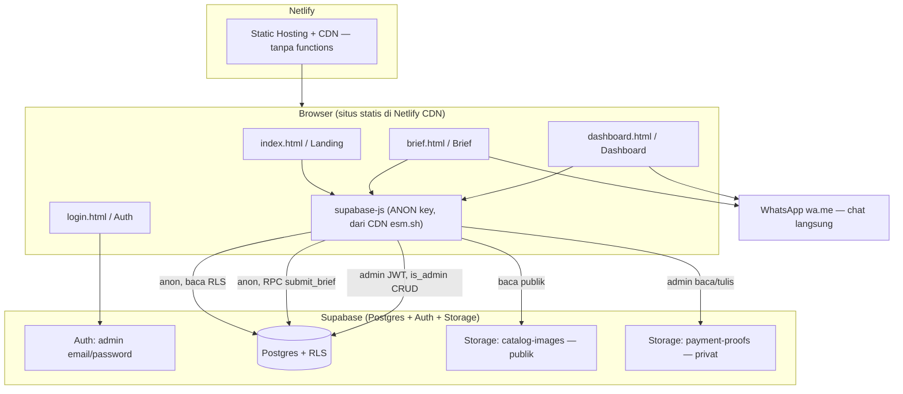

# LogoKu

Jasa desain logo berbasis web. Aplikasi ini adalah **situs statis murni** yang di-host di
**Netlify** dan berkomunikasi langsung dengan **Supabase** (Postgres + Auth + Storage).
Tidak ada server tier, tidak ada Netlify Functions, dan tidak ada OTP. Pemesanan dilakukan
lewat **chat WhatsApp langsung** (`wa.me`), sedangkan otorisasi sepenuhnya ditegakkan oleh
**Row Level Security (RLS)** di Supabase.

---

## 1. Ringkasan Proyek & Arsitektur

LogoKu memungkinkan pengunjung menelusuri katalog/portofolio logo tanpa login, mengisi brief
kreatif, lalu melanjutkan ke chat WhatsApp untuk negosiasi. Admin login lewat Supabase Auth
(email/password) untuk mengelola pesanan, pelanggan, dan katalog.

Prinsip arsitektur:

- **Frontend statis** (HTML/CSS/JS vanilla) di-deploy apa adanya ke Netlify, tanpa build wajib.
- **`@supabase/supabase-js` dimuat dari CDN** (`esm.sh`), jadi browser butuh koneksi internet.
- **Hanya nilai client-safe** yang dikirim ke browser: `SUPABASE_URL`, `SUPABASE_ANON_KEY`, dan
  `ADMIN_WHATSAPP_NUMBER`. **Tidak ada service-role key** di mana pun.
- **RLS adalah satu-satunya batas otorisasi.** Anon hanya bisa membaca katalog/kategori yang
  publish dan menulis pesanan lewat fungsi RPC `submit_brief`. Admin melakukan CRUD memakai JWT
  hasil login (`is_admin()`).
- **Pemesanan = chat langsung** ke nomor admin via `wa.me` dengan pesan terisi otomatis. Tidak
  ada WhatsApp API maupun OTP.



Singkatnya: **Browser ⇄ Netlify (statis) ⇄ Supabase**, ditambah **Browser → WhatsApp (chat langsung)**.

---

## 2. Struktur Folder

```
/                              # root repo = "publish dir" Netlify
├── index.html                 # Landing (katalog, harga, FAQ, tombol WhatsApp)
├── brief.html                 # Form brief kreatif → RPC submit_brief → handoff wa.me
├── login.html                 # Auth admin (Masuk / Daftar) via Supabase Auth
├── dashboard.html             # Dashboard admin (pesanan, pelanggan, katalog, setelan)
├── assets/
│   ├── css/
│   │   └── app.css            # tema gelap "3D glass"
│   └── js/
│       ├── auth.js
│       ├── env.example.js     # template env client-safe (copy → env.js)
│       ├── env.js             # nilai env aktual (di-load sebagai window.__ENV__)
│       └── lib/
│           ├── supabaseClient.js   # client supabase-js (anon key saja, dari CDN)
│           ├── orders.js           # submit brief publik via RPC
│           ├── admin.js            # CRUD admin via supabase-js (RLS is_admin())
│           ├── phone.js            # normalisasi nomor WhatsApp
│           └── wa.js               # pembangun URL handoff wa.me
├── supabase/
│   ├── migrations/
│   │   └── 0001_init.sql      # skema + enum + RLS + RPC + bucket Storage
│   └── seed.sql               # data contoh (kategori + katalog) — opsional
├── tests/
│   └── phone.test.js          # unit test (vitest)
├── netlify.toml               # konfigurasi Netlify (publish ".", tanpa functions)
├── package.json
├── vitest.config.js
├── .env.example               # dokumentasi variabel env (tidak ada secret)
└── _legacy/                   # arsip aplikasi PHP lama (index.php, brief.php, admin/, core/, config/, includes/)
```

> Folder `_legacy/` berisi aplikasi PHP/MySQL lama yang **diarsipkan** sebagai referensi. Folder ini
> tidak dipakai saat runtime dan tidak perlu di-publish ke Netlify.

---

## 3. Prasyarat

- **Node.js** (LTS terbaru disarankan) + npm — untuk menjalankan test dan tooling.
- **Akun Supabase** (supabase.com) — wajib, sebagai backend.
- **Akun Netlify** — untuk deploy produksi.
- **Supabase CLI** — *opsional*, hanya jika ingin menjalankan/menguji database secara lokal.
- **Netlify CLI** — *opsional*, jika ingin memakai `netlify dev` (sudah tersedia sebagai devDependency).

---

## 4. Setup Supabase

### 4.1 Buat project

Buat project baru di [supabase.com](https://supabase.com). Catat **Project URL** dan **anon public
key** dari menu *Project Settings → API* (dipakai pada langkah 5).

### 4.2 Jalankan migrasi

Migrasi `supabase/migrations/0001_init.sql` membuat seluruh skema: enum, tabel
(`categories`, `catalogs`, `customers`, `orders`, `admin_profiles`), trigger, fungsi `is_admin()`,
fungsi RPC `submit_brief`, kebijakan RLS, **serta bucket Storage**.

**Cara A — Supabase CLI (lokal/terhubung):**

```bash
# Opsi 1: jalankan stack Supabase lokal, lalu migrasi otomatis di-apply
supabase start
# (migrasi di folder supabase/migrations otomatis dijalankan saat start/reset)
supabase db reset      # apply ulang migrasi + seed.sql ke DB lokal

# Opsi 2: push migrasi ke project Supabase remote yang sudah di-link
supabase link --project-ref <project-ref>
supabase db push
```

> Script bawaan `package.json`: `npm run db:start` (= `supabase start`) dan
> `npm run db:reset` (= `supabase db reset`).

**Cara B — manual lewat SQL Editor (tanpa CLI):**

1. Buka dashboard Supabase → **SQL Editor**.
2. Salin seluruh isi `supabase/migrations/0001_init.sql`, tempel, lalu **Run**.
3. (Opsional) Salin isi `supabase/seed.sql`, tempel, **Run** untuk mengisi data contoh
   (kategori + katalog).

### 4.3 Bucket Storage

**Tidak perlu dibuat manual** — migrasi sudah membuatnya beserta kebijakannya:

- `catalog-images` → **publik** (baca oleh siapa saja, tulis hanya admin).
- `payment-proofs` → **privat** (baca hanya admin).

### 4.4 Aktifkan Email/Password Auth

Buka *Authentication → Providers* dan pastikan **Email** (password) aktif. Untuk **produksi**,
disarankan **Confirm email = ON** agar pendaftaran admin terverifikasi.

### 4.5 Promosikan admin pertama

Saat seseorang mendaftar (signup), trigger `handle_new_user()` otomatis membuat baris di
`admin_profiles` dengan `role = 'pending'`. Akun `pending` **belum** punya akses admin.

Admin pertama harus dipromosikan **manual** lewat SQL Editor:

```sql
update admin_profiles
set role = 'owner'
where id = (select id from auth.users where email = 'email-admin-anda@contoh.com');
```

Setelah ada `owner`, owner tersebut dapat menaikkan peran akun lain (`pending` → `admin`/`owner`)
sesuai kebijakan RLS `owner manages roles`.

---

## 5. Konfigurasi Environment (Client)

Nilai env disuntikkan ke browser sebagai `window.__ENV__` melalui file `assets/js/env.js`.

```bash
# dari root repo
cp assets/js/env.example.js assets/js/env.js
```

Lalu isi `assets/js/env.js`:

```js
window.__ENV__ = {
  SUPABASE_URL: 'https://YOUR_PROJECT.supabase.co',
  SUPABASE_ANON_KEY: 'your-anon-key',
  ADMIN_WHATSAPP_NUMBER: '6285236314038',
};
```

> **Penting:** ketiga nilai ini **PUBLIK / client-safe**. `SUPABASE_ANON_KEY` aman dibawa di
> browser karena akses tetap dibatasi oleh RLS. **TIDAK ADA service-role key** atau secret lain di
> sisi klien. File `.env.example` di root hanya dokumentasi variabel yang sama.

---

## 6. Menjalankan Secara Lokal

Karena ini situs statis, cukup sajikan root repo dengan static server mana pun:

```bash
# pilih salah satu
npx serve .
# atau
python -m http.server 8000
```

Buka `http://localhost:3000` (serve) atau `http://localhost:8000` (http.server).

Alternatif (opsional) memakai Netlify CLI agar mirip lingkungan produksi:

```bash
npx netlify dev      # atau: npm run dev
```

> **Catatan koneksi internet:** `supabase-js` dimuat dari CDN `https://esm.sh/@supabase/supabase-js@2`,
> sehingga aplikasi tetap butuh koneksi internet meski dijalankan lokal. Pastikan juga `assets/js/env.js`
> sudah dibuat (langkah 5), kalau tidak client akan masuk mode fallback dan menampilkan peringatan di console.

---

## 7. Menjalankan Test

```bash
npm install
npx vitest run      # atau: npm test
```

Test berada di folder `tests/` (mis. `tests/phone.test.js`) dan dikonfigurasi lewat `vitest.config.js`
(environment `node`).

---

## 8. Deploy ke Netlify

1. **Hubungkan repo Git** ke Netlify (New site from Git).
2. **Publish directory = root** (`.`). Lihat `netlify.toml`:
   - `publish = "."`
   - Tidak ada section `[functions]` dan tidak ada redirect `/api` — memang **tanpa serverless function**.
   - Hanya ada fallback 404 ke `/index.html`.
3. **Sediakan `assets/js/env.js` saat produksi.** Ada dua opsi, pilih salah satu:

   **Opsi A — generate `env.js` dari Netlify env saat build.**
   Simpan `SUPABASE_URL`, `SUPABASE_ANON_KEY`, `ADMIN_WHATSAPP_NUMBER` di *Site settings → Environment
   variables*, lalu tulis `env.js` lewat build command sederhana, mis.:

   ```toml
   # netlify.toml
   [build]
     publish = "."
     command = "printf 'window.__ENV__=%s;' \"$(node -e \"console.log(JSON.stringify({SUPABASE_URL:process.env.SUPABASE_URL,SUPABASE_ANON_KEY:process.env.SUPABASE_ANON_KEY,ADMIN_WHATSAPP_NUMBER:process.env.ADMIN_WHATSAPP_NUMBER}))\")\" > assets/js/env.js"
   ```

   (atau `echo`/script kecil setara yang menulis file `assets/js/env.js`).

   **Opsi B — commit `env.js` langsung ke repo.**
   Karena anon key bersifat publik, secara teknis aman untuk di-commit.

   **Trade-off:** Opsi A menjaga nilai terpusat di Netlify dan mudah diganti per-environment tanpa
   menyentuh repo, tetapi menambah build command. Opsi B paling sederhana (deploy murni statis tanpa
   build), tetapi nilai ikut ter-commit di Git dan harus diubah manual saat ganti project. Keduanya
   sama-sama aman karena tidak ada secret — hanya nilai client-safe.

> Tidak ada functions, tidak ada redirect `/api`. Deploy = unggah file statis ke CDN.

---

## 9. Custom Domain + HTTPS

1. Di Netlify: **Domains → Add a domain**, masukkan domain Anda.
2. Arahkan DNS:
   - **Netlify DNS** (pakai nameserver Netlify), atau
   - **CNAME** untuk subdomain (mis. `www`), dan **A / ALIAS** untuk apex/root domain ke Netlify.
3. Netlify otomatis **provisi sertifikat TLS Let's Encrypt** setelah DNS aktif.
4. Aktifkan **Force HTTPS** agar semua trafik dialihkan ke HTTPS.
5. **Update Supabase Auth → URL Configuration:**
   - **Site URL:** domain produksi (mis. `https://logoku.com`).
   - **Redirect URLs:** tambahkan domain produksi **dan** URL deploy-preview Netlify
     (mis. `https://<deploy-preview>--<site>.netlify.app`) agar login/registrasi dan reset password
     bekerja di semua environment.

---

## 10. Keamanan (Ringkas)

- **RLS adalah satu-satunya batas otorisasi.** Tidak ada server tier yang bisa menambal celah, jadi
  semua aturan akses ditegakkan di Postgres.
- **Anon (publik):** hanya boleh **membaca** `categories` dan `catalogs` yang `is_published = true`,
  dan **menulis pesanan hanya lewat RPC `submit_brief`** (fungsi `security definer` yang memvalidasi
  input lalu membuat `customers` + `orders` secara atomik). Anon **tidak punya** policy
  SELECT/UPDATE/DELETE pada `customers`/`orders`, sehingga tidak bisa membaca atau mengubah pesanan
  siapa pun — termasuk miliknya sendiri.
- **Admin:** seluruh CRUD pesanan/pelanggan/katalog memakai **JWT** hasil login dan hanya lolos bila
  `is_admin()` bernilai true (peran `admin`/`owner`). Hanya `owner` yang dapat mengubah peran.
- **Storage:** `catalog-images` publik untuk dibaca (tulis hanya admin); `payment-proofs` privat
  (baca hanya admin).
- **Tidak ada secret di klien.** Hanya `SUPABASE_URL`, `SUPABASE_ANON_KEY`, dan
  `ADMIN_WHATSAPP_NUMBER` yang dikirim ke browser. Service-role key tidak digunakan.

---

## 11. Catatan Migrasi Data Legacy

Aplikasi lama berbasis PHP + MySQL (XAMPP) dan diarsipkan di folder **`_legacy/`**
(`index.php`, `brief.php`, `admin/`, `core/`, `config/`, `includes/`, beserta dump
`config/jasa_desain_baru.sql`). Volume data produksi lama sangat kecil (sekitar **3 baris pesanan**),
sehingga migrasi otomatis tidak disediakan — **input ulang manual** lewat dashboard admin atau SQL
Editor sudah cukup. Arsip `_legacy/` dipertahankan sebagai referensi logika bisnis dan dapat dihapus
pada pembersihan lanjutan setelah produksi terverifikasi.
